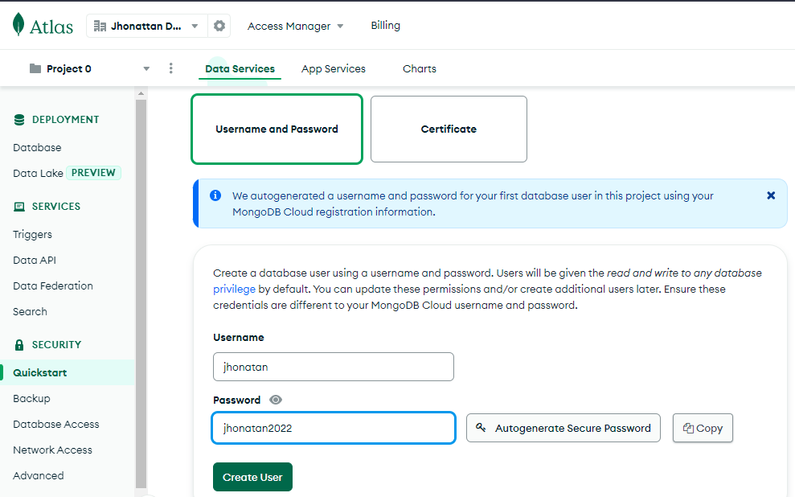
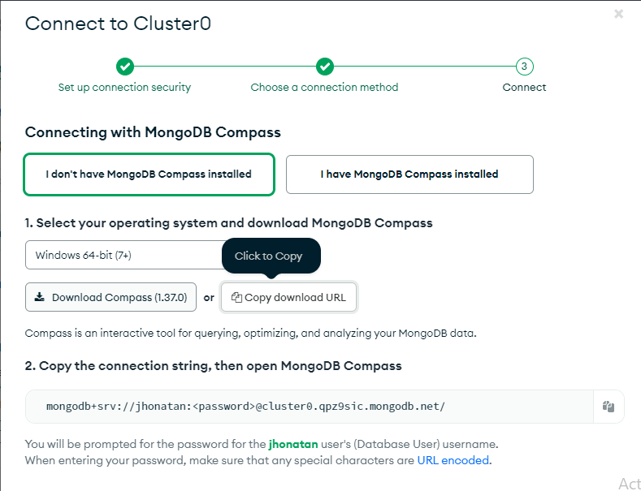

## Conexión a MongoDB Atlas

1. Vamos a la sección `Quick Start` y creamos `Nombre de usuario` y `Contraseña` para nuestro cluster.

2. Indicamos la IP que tendrá acceso al cluster y nos dirigirnos a `Database Access`.

3. Cargamos información de ejemplo, vamos a `Collections` seleccionamos `Load Sample Dataset`, cargará datos de ejemplo.

- [Documentación de los datos](https://www.mongodb.com/docs/atlas/sample-data/).

4. Para ver los datos vamos a `Browse Collections`.

## Usanso MongoDB Compass

1. Vamos a `Database` seleccionamos `Connect`, y la opción `Connect with MongoDB Compass`. Seleccionamos el sistema operativo y descargamos [MongoDB Compass](https://www.mongodb.com/try/download/compass).

4. Copiamos la cadena que se nos muestra en `Connect` y la pegamos en `MongoDB Compass` tenemos que digitar la contraseña.

## Mongo Atlas desde Visual Studio Code

1. Instalamos la extencion [MongoDB for VS Code](https://marketplace.visualstudio.com/items?itemName=mongodb.mongodb-vscode)

2. Damos click en el icono de `MongoDB` y seleccionamos `Connect to MongoDB`. Ingresamos la cadena de conexión como con mongo atlas y damos enter.

# Modelado de datos MongoDB

## Pasos

1. Creamos una base de datos y le asignamos (usuario, contraseña, admin, ip). Cargamos datos de ejemplo

2. Conectamos a mongo Compass y VSCode

3. Comandos con permisos de administrador

# Webs de utilidad

- [MongoDB](https://www.mongodb.com/es)
- [Mongo Query](https://docs.mongodb.com/manual/tutorial/query-documents/) Como hacer consultas en MongoDB
