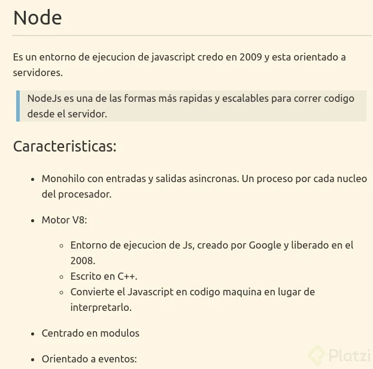

# Fundamentos Node.js

[Node.js](https://nodejs.org/es/)

## Origenes



## Recibiendo una variable de entorno por consola

```sh
# Definimos primero la variable de entorno
$env:NOMBRE="Juan"
# Ejecutamos el archivo
node V-entorno.js
```

## Nodemon y PM2 (Reiniciar el servidor automaticamente)

- Nodemon: Es una herramienta que nos permite reiniciar el servidor automaticamente cada vez que se detecte un cambio en el código.

```sh
# Instalamos nodemon de forma global
npm install -g nodemon
# Corremos el documento con nodemon
nodemon V-entorno.js
```

## Async - Await (Manejo de promesas)

- Async: Se utiliza para declarar una función como asincrona.
- Await: Se utiliza para esperar a que una promesa se resuelva.

## Globals (Variables globales)

```sh
# Vemos los modulos globales
console.log(global);
```

## OS (Información del sistema operativo)

```sh
# Vemos la información del sistema operativo
const os = require("os");
console.log(os.platform());
```
