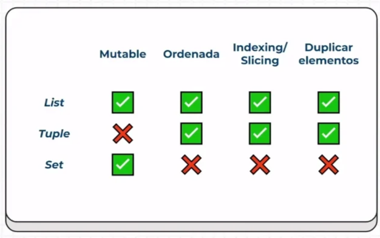
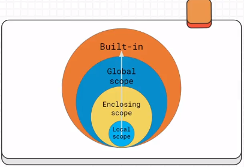
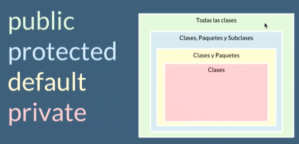
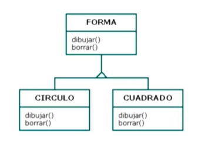
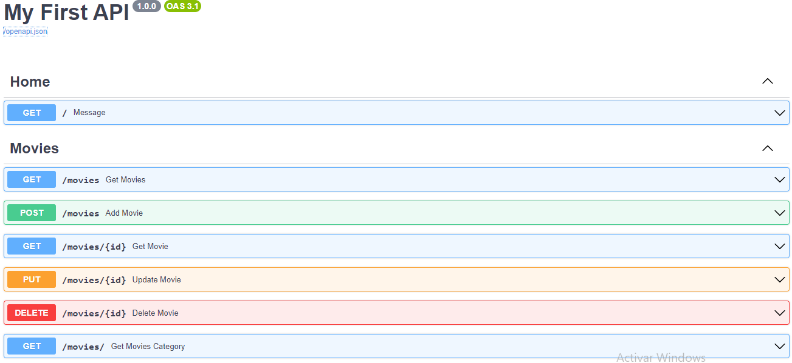

# Comprehension, Funciones y Manejo de Errores

## Comprehension



## Scope



# Programación Orientada a Objetos POO

## Java:

- Orientado a Objetos naturalmente
- Es muy utilizado en Android
- Y es usado del lado del servidor o Server Side

## PHP

- Lenguaje interpretado por el servidor
- Pensado para la Web

## Python

- Diseñado para ser fácil de usar
- Múltiples usos: Web, Server Side, Análisis de Datos, Machine Learning, etc

## Javascript

- Lenguaje interpretado
- Orientado a Objetos pero basado en prototipos
- Pensado para la Web

# Objetos

1. Los Objetos son aquellos que tienen propiedades y comportamientos, también serán sustantivos (Pueden ser Físicos o Conceptuales).

## Abstracción y Clases

- Clase : Modelo creado a base de la abstracción de un objeto.
- Abstracción : Proceso que separa las características de un objeto para generar un molde.


## Modularidad

1. La modularidad de nuestro código nos va a permitir

- Reutilizar
- Evitar colapsos
- Hacer nuestro código más mantenible
- Legibilidad
- Resolución rápida de problemas

2. Una buena práctica es separando las clases en archivos diferentes.

## Encapsulamiento



## Polimorfismo



# FastAPI Introducción, Operaciones, Validaciones y Autenticación

## Requisitos previos

- [FastAPI](https://fastapi.tiangolo.com/)

### Características

- Rápido
- Menos errores
- Fácil e intuitivo
- Robusto
- Basado en estándares

```bash
# Ejecución de FastAPI
uvicorn main:app --reload
```

## Swagger UI (Documentación automática del API)

1. Si agregamos `/docs` a la URL, podemos ver la documentación de nuestra API. Si damos click en `openapi.json` veremos la documentación JSON.



## Códigos de estado

- [100 - 199](https://developer.mozilla.org/es/docs/Web/HTTP/Status/100): Respuestas informativas
- [200 - 299](https://developer.mozilla.org/es/docs/Web/HTTP/Status/200): Respuestas satisfactorias
- [300 - 399](https://developer.mozilla.org/es/docs/Web/HTTP/Status/300): Redirecciones
- [400 - 499](https://developer.mozilla.org/es/docs/Web/HTTP/Status/400): Errores del cliente
- [500 - 599](https://developer.mozilla.org/es/docs/Web/HTTP/Status/500): Errores del servidor
