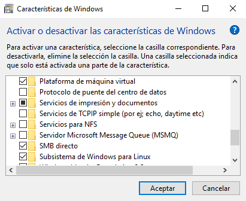
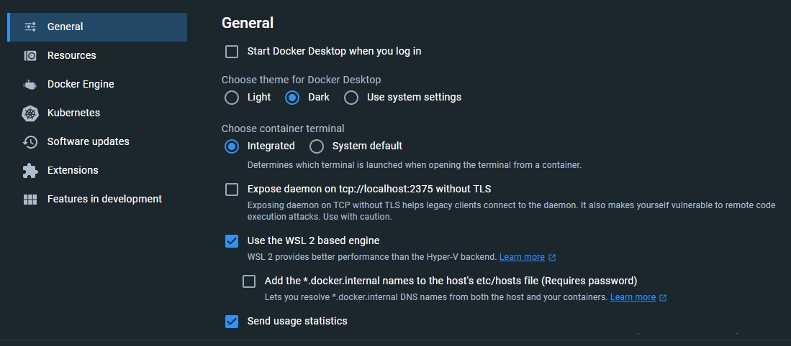
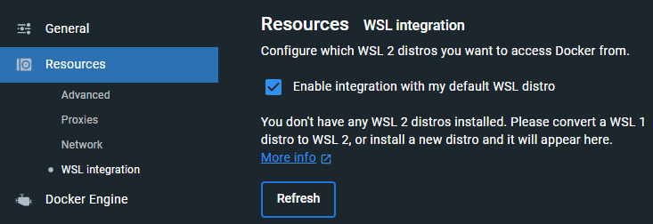
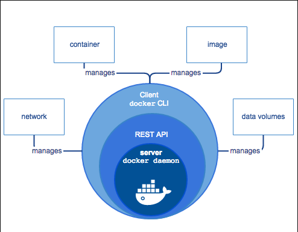

# Docker

## Webs de interes

- [WSL2](https://docs.microsoft.com/en-us/windows/wsl/install-win10)
- [Explicado con gatitos](https://teloexplicocongatitos.com/)
- [Docker](https://www.docker.com/)

## Instalacion de Docker

- [Docker Desktop](https://www.docker.com/products/docker-desktop)

1. Verificamos en los `Features` de Windows que este activado `Windows Subsystem for Linux` y `Virtual Machine Platform`.



4. Confirmamos el checkeo de los siguientes componentes de Docker Desktop:




```sh
# Para loguear en docker desde la consola
docker login -u <username> -p <password> # o docker login
```

## Arquitecura de Docker



## Hello World

1. Ejecutamos el comando `docker run hello-world`

2. Podemos ver en `docker desktop` que se ha creado un contenedor `hello-world`

## Qué es un contenedor

- Es una agrupación de procesos.

- Ejecuta sus procesos de forma nativa.

- Los procesos que se ejecutan adentro de los contenedores ven su universo como el contenedor lo define, no pueden ver mas allá del contenedor, a pesar de estar corriendo en una maquina más grande.

- No tienen forma de consumir más recursos que los que se les permite. Si esta restringido en memoria ram por ejemplo, es la única que pueden usar.

- Docker corre de forma nativa solo en Linux.

- Sector del disco: Cuando un contenedor es ejecutado, el daemon de docker le dice, a partir de acá para arriba este disco es tuyo, pero no puedes subir mas arriba.

- Docker hace que los procesos adentro de un contenedor este aislados del resto del sistema, no le permite ver más allá.

# Algunos comandos de Docker

```sh
# Para ver la version de docker
docker --version

# Para ver la informacion de docker
docker info
```

## Ver los contenedores que tenemos corriendo

```sh
docker ps # Solo los que estan corriendo
docker ps -a # Todos los contenedores
```

## Ver la data de los contenedores

```sh
docker inspect <container_id> # También se puede usar el nombre del contenedor
```

## Asignando un nombre a un contenedor

```sh
docker run --name <nombre> <imagen> # No se puede usar el nombre de un contenedor que ya existe
```

## Renombrar un contenedor

```sh
docker rename <nombre_actual> <nuevo_nombre>
```

## Eliminar un contenedor

```sh
docker rm <nombre> # No se puede eliminar un contenedor que este corriendo
docker rm -f <nombre> # Para eliminar un contenedor que este corriendo
```

## Eliminar todos los contenedores que esten detenidos

```sh
docker container prune # Nos preguntara si queremos eliminar los contenedores detenidos
```

## Corriendo un contenedor de ubuntu

```sh
docker run ubuntu # Corre el contenedor y se detiene
docker run -it ubuntu # Corre el contenedor y se queda en la terminal del contenedor
# i = interactive
# t = terminal
```

```sh
# Comprobamos que estamos en ubuntu
cat /etc/lsb-release # Para ver la version de ubuntu
```

1. Podemos comprobar en docker desktop que esta corriendo un contenedor de ubuntu.

```sh
# Salimos del contenedor
exit # o ctrl + d
# Se detiene el contenedor
```

## Corriendo un contenedor de ubuntu sin que se detenga

```sh
# Nos devuelve el id del contenedor que se esta ejecutando
docker run --name eterno -d ubuntu tail -f /dev/null # Corre el contenedor y no se detiene
# d = detached (desconectado)
```

```sh
# Accedemos al contenedor eterno
docker exec -it eterno bash
```

```sh
# Vemos los procesos que se estan ejecutando en el contenedor
ps
ps -aux # Para ver todos los procesos
```

```sh
# Obtenemos el process id del contenedor eterno
docker inspect --format '{{.State.Pid}}' eterno
```

```sh
# Matamos el proceso del contenedor eterno
kill -9 <process_id>
# Otra forma
docker kill eterno
```

## Corriendo nginx (Servidor web HTTP)

```sh
docker run -d --name webserver nginx # Corre por defecto en el puerto 80
```

```sh
# Apagamos el contenedor
docker stop webserver
```

```sh
# Corremos el contenedor en el puerto 8080 de nuestra maquina y en el puerto 80 del contenedor
docker run --name webserver -p 8080:80 nginx
# No ponemos el -d para ver los logs del contenedor (ctrl + c para salir)
```

```sh
# Lo corremos con distach para que se ejecute en segundo plano
docker run -d --name webserver -p 8080:80 nginx

# Vemos los logs del contenedor
docker logs webserver

# Vemos los logs del contenedor en tiempo real
docker logs -f webserver

# Delimitamos la cantidad de logs que queremos ver
docker logs --tail 5 webserver
```

## Manejo de datos en contenedores

```sh
# Corremos un contenedor de mongoDB
docker run -d --name db mongo

# Ejecutamos un contenedor de mongoDB y nos conectamos a mongo por la bash
docker exec -it db bash

# Nos conectamos a mongo
# A partir de mongo 4.4 se usa el shell mongosh
mongosh
```

### Bind mounts (Montaje de enlace)

```sh
docker run -d --name db -v C:\Users\jflorez\Documents\prueba:/data/db mongo
# -v = volume
# C:\Users\jflorez\Documents = directorio de la maquina
# /data/db = directorio del contenedor
```

## Volumenes (Manejo de datos en contenedores) (Persistencia de datos)

```sh
# Vemos los volumenes que tenemos
docker volume ls

# Creamos un volumen
docker volume create data

# Vemos la informacion del volumen
docker volume inspect data
```

```sh
# Corremos un contenedor de mongoDB con el volumen que creamos
# Si el volumen no existe, lo crea
docker run -d --name db --mount src=data,dst=/data/db mongo
# src = source
# dst = destination
```

```sh
# Inspeccionamos el contenedor para ver que el volumen esta montado
docker inspect db
```

## Insertar y extraer archivos de un contenedor

```sh
docker run -d --name copytest ubuntu tail -f /dev/null

# Copiamos un archivo de la maquina al contenedor
docker cp C:\Users\jflorez\Documents\prueba\hola.txt copytest:/testing/holacopiado.txt
# cp = copy

# Entramos del contenedor a la maquina local
docker copytest:/testing C:\Users\jflorez\Documents\prueba\testing
```

## Datos en docker

- Host: Donde Docker esta instalado.
- Bind Mount: Guarda los archivos en la maquina local persistiendo y visualizando estos datos (No seguro).
- Volume: Guarda los archivos en el area de Docker donde Docker los administra (Seguro).
- TMPFS Mount: Guarda los archivos temporalmente y persiste los datos en la memoria del contenedor, cuando muera sus datos mueren con el contenedor.

## Profundizando en Imagenes

### Imágen

- Una imágen contiene distintas capas de datos (distribución, diferente software, librerías y personalización).

- - Podemos llegar a la conslusión, que una imágen se conforma de distintas capas de personalización, en base a una capa inicial (base image), la dicha capa, es el más puro estado del SO.


1. Si observamos, partimos desde la base del SO, y vamos agregando capas de personalización hasta obtener la imágen que necesitamos:

- distribución debian
- se agrega el editor emacs
- se agrega el servidor Apache
- se agregan los permisos de escritura para la carpeta /var/www de Apache
- Hay que tener en cuenta, que todo parte del Kernel de Linux, en caso de utilizar alguna distrubución de Linux

### Historico de una imágen

Podemos observar la historia de nuestra imágen, con el siguiente comando:

```sh
docker history <image_name>
```

```sh
# Vemos la lista de imagenes que tenemos
docker image ls
```

1. Podemos ver las versiones de la imágen que tenemos en `Docker Hub` para descargar con el siguiente comando:

- La version `latest` es la ultima version de la imágen.

```sh
docker pull <image_name>:<version>
# pull = descargar
# Si no especificamos la version, se descargara la ultima version
```

```sh
# Bajamos otra version de ubuntu
docker pull ubuntu:20.04
# Si contienen el mismo image id, es la misma imágen
```

## Creando una imágen propia (Dockerfile)

```sh
docker build -t ubuntu:prueba C:\Users\jflorez\Documents\git\Formacion-Practica\Cursos\Bash\Docker\File
# build = construir
# -t = tag (nombre de la imágen)
# C:\Users\jflorez\Documents\git\ = ruta del Dockerfile
```

```sh
# Corremos nuestra imagen y comprobamos la creación del archivo
docker run -it ubuntu:prueba
cd tmp
```

## Publicando una imágen en Docker Hub

```sh
# Nos logueamos en docker
docker login # Pedira usuario y contraseña
```

```sh
# Cambiamos información de la imagen
docker tag ubuntu:prueba jhonatan2022/ubuntu:FirstImage
# tag = etiqueta
```

```sh
# Subimos la imagen a docker hub
docker push jhonatan2022/ubuntu:FirstImage
```

## Docker dive (Analizar imagenes)

- [Repositorio](https://github.com/wagoodman/dive/releases)

1. Descargamos la ultima version `dive_x.xx.x_windows_amd64.zip` lo descomprimimos y agregamos el ejecutable a la variable de entorno `PATH`.

```sh
# Analizamos la imagen de ubuntu que creamos anteriormente con dive (analizador de imagenes)
dive ubuntu:prueba
# Con ctrl + U podemos ver los campos modificados
# Con ctrl + D podemos ver los campos eliminados
# Con ctrl + R podemos ver los campos agregados
# Con ctrl + C salimos de dive
```

## Docker para desarrollar apps

```sh
# Corremos el dokerfile de la carpeta app que esta dentro de la carpeta File
docker build -t appnode .
# build = construir
```

```sh
# Corremos la imagen
docker run --rm -p 3000:3000 appnode
# --rm = elimina el contenedor cuando se detiene
# -p = puerto
# Como no indicamos ditach, se ejecuta en primer plano

# Corremos la app en segundo plano y montamos solo el index.js
docker run --rm -p 3000:3000 -v C:/Users/jflorez/Documents/git/Formacion-Practica/Content/Bash/Docker/File/app/index.js:/usr/src/index.js appnode
```

## Docker networking (Colaboración entre contenedores)

```sh
# Vemos la lista de redes que tenemos
docker network ls
# bridge = red por defecto de docker
# host = red del host de docker (no recomendado)
# none = red sin acceso a internet
```

```sh
# Creamos una red
docker network create --attachable rednode
# --atachable = permite que los contenedores se conecten a la red
```

```sh
# Inspeccionamos la red
docker network inspect rednode
```

```sh
# Creamos un contenedor de mongoDB limpio
docker run -d --name db mongo

# Conectamos el contenedor a la red
docker network connect rednode db
```

```sh
# Corremos el contenedor con la app y mongo conectados a la red
docker run -d --name app -p 3000:3000 --env MONGO_URL=mongodb://db:27017/test appnode
# --env = variable de entorno

docker network connect rednode app
```

## Docker compose (Orquestador de contenedores)

- [Documentación](https://docs.docker.com/compose/)

```sh
# Creamos primero la imagen de la appnode
docker build -t appnode .

# Corremos el docker compose
docker-compose up
# up = levantar
# Si no esta creada la red, la crea
# Sale con ctrl + c
```

```sh
# Docker-compose crea una red por defecto
docker network ls
```

```sh
# Ejecutamos una bash en el contenedor de la app
docker-compose exec app bash
```

```sh
# Destruimos los contenedores
docker-compose down
# down = bajar
```

## Docker compose para desarrollar

```sh
# Le indicamos a docker compose que haga un build de la imagen de la app
docker-compose build
# build = construir
```

```sh
# Corremos dos instancias de la app
docker-compose up -d --scale app=2
# -d = detached
# --scale = escalar (cantidad de instancias)
```

## Administrando ambientes con docker compose

```sh
# Eliminar todos los contenedores tanto activos como inactivos
docker rm -f $(docker ps -aq)
# rm = remove
# -f = force
# ps = process
# -a = all
# -q = quiet (solo muestra los ids)
```

```sh
# Eliminar todos los datos de docker
docker system prune
# system = sistema
# prune = podar
```

```sh
# Eliminar todos los datos de docker incluyendo imagenes
docker system prune -a
```

## Manejo de memoria

```sh
# Indicamos la cantidad de memoria que puede usar un contenedor
docker run -d --name app --memory 1g appnode
# --memory = memoria
# 1g = 1 giga
# el minimo de memoria que permite docker es 4m (4 megas)
```

```sh
# revisamos la memoria que esta usando el contenedor
docker stats app
```

## SHELL vs EXEC (Detener contenedores correctamente)

```sh
# Conruimos la imagen que tenemos en el directorio avanzado/loop
docker build -t loop .

# Corrremos un contenedor usando loop
docker run -d --name looper loop

# Si docker stop se demora mas de 10 segundos, se ejecuta docker kill (detiene el contenedor de forma brusca)
```

## Entrypoint vs CMD (Ejecutar comandos al iniciar un contenedor)

```sh
docker build -t ping .

# Podemos pingear a google
docker run --name pinger ping google.com
```

## El contexto de docker build

```sh
# Creamos un dockerignore para ignorar archivos que no queremos que se copien al contenedor
touch .dockerignore

# Contenido
*.log
.dockerignore
.git
.gitignore
build/*
Dockerfile
node_modules
npm-debug.log*
README.md
```

## Multi-stage build (Construir imagenes de forma mas eficiente)

```sh
docker build -t produapp -f build/production.Dockerfile .
# -f = file, podemos especificar el nombre del dockerfile
```

```sh
# Corremos la imagen
docker run -d --name prod produapp

# Corremos el contenedor
docker exec -it prod bash
```

## Docker in docker (Docker dentro de docker)

```sh
# Montamos el socket de docker dentro del contenedor
# Socket = archivo que permite la comunicación entre procesos
docker run -it --rm -v //var/run/docker.sock:/var/run/docker.sock docker:19.03.12
# //var/run/docker.sock = socket de docker
# /var/run/docker.sock = socket del contenedor
# docker:19.03.12 = imagen de docker
```
