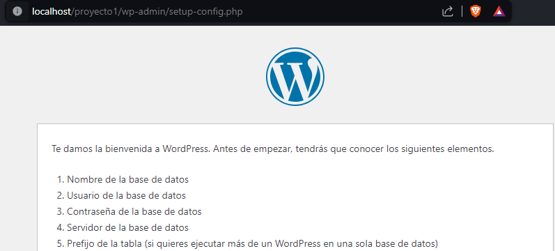
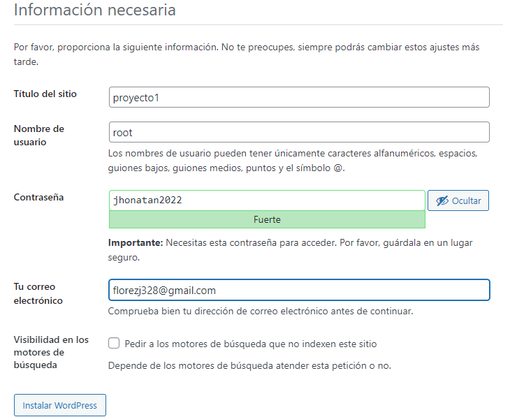
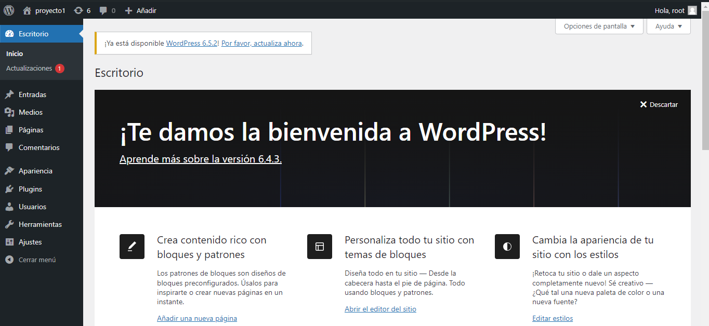

<strong>Instalación</strong>

+ [Instalación de XAMPP](https://www.apachefriends.org/es/index.html)
+ [Instalación de WordPress](https://es.wordpress.org/download/)

1. Extraemos los documentos de la carpeta de `WordPress`, asignamos el nombre del `Proyecto` a la carpeta y la movemos a `xampp/htdocs`

2. Corremos el servideor de `XAMPP` y abrimos el `Panel de Control` para crear una base de datos.

3. Ingresamos a `localhost/nombre_proyecto` para iniciar la configuración del `Proyecto`

4. Terminanos de diligenciar los campos y damos clic en `Instalar WordPress`

5. Ingresamos y aremos el `Login` con los datos que ingresamos en la configuración

  