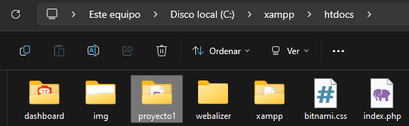

<strong>Instalación</strong>

+ [Instalación de XAMPP](https://www.apachefriends.org/es/index.html)
+ [Instalación de WordPress](https://es.wordpress.org/download/)

1. Extraemos los documentos de la carpeta de `WordPress`, asignamos el nombre del `Proyecto` a la carpeta y la movemos a `xampp/htdocs`

  